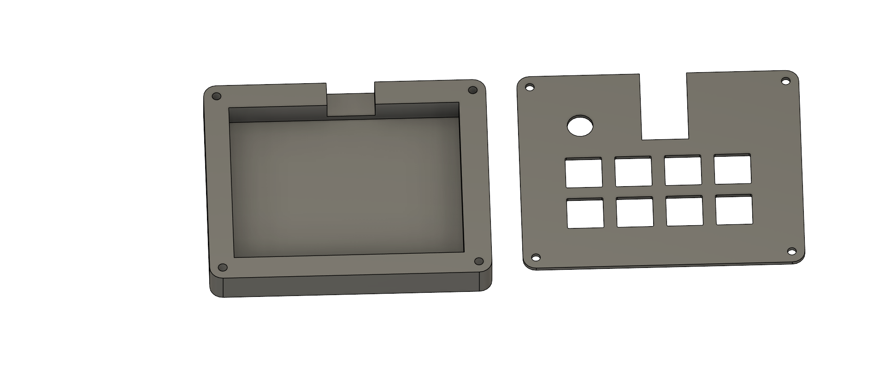
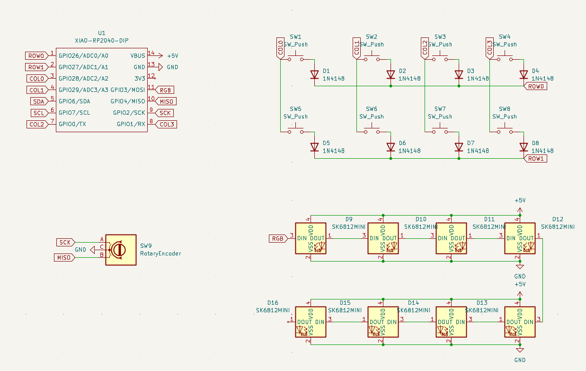
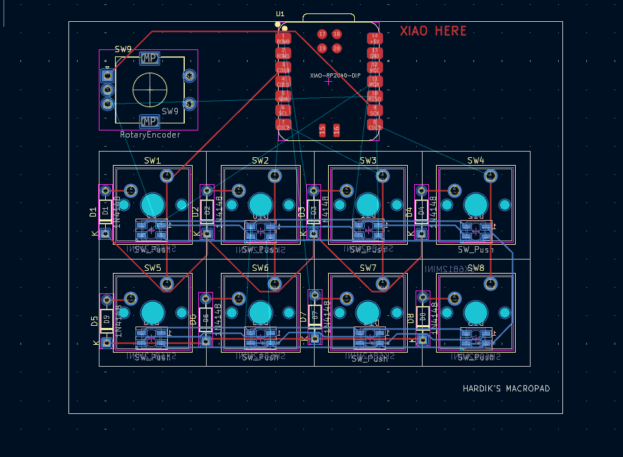

# Hardik's-hackpad
Its my personal hackpad made with the help of hack club 

# This will be the design of my hackpad/macropad  
  

# These are the bottom and top cases  
  

# This is the schematic  
  

# This is the PCB  
  

# 🛠️ Hardware Bill of Materials (BOM)  
Seeed XIAO RP2040 - x1  
Through-hole 1N4148 Diodes - x8  
MX-Style switches - x8  
EC11 Rotary encoders - x1  
Blank DSA keycaps - x8  
SK6812 MINI-E LEDs - x8  
M3x16mm Screws & M3 Heatset Inserts - x4  
